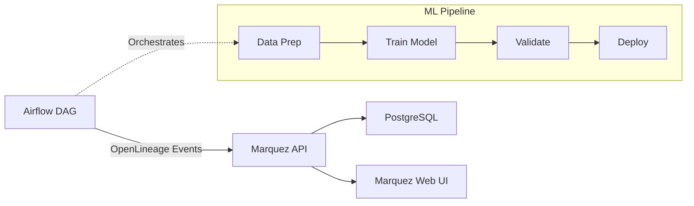

# OpenLineage-Powered Data & Model Lineage Graph

A production-ready implementation of data lineage tracking for ML pipelines using Apache Airflow and Marquez (OpenLineage backend).

## Overview

This project demonstrates comprehensive lineage tracking across the entire ML lifecycle:
- **Data Lineage**: Track data sources, transformations, and dataset versions
- **Model Lineage**: Trace which datasets produced which models
- **Deployment Lineage**: Monitor when models were deployed and their configurations

## Why It Matters

- **Compliance & Auditing**: Answer "who changed what, when?" for regulatory requirements
- **Debugging**: Quickly trace issues back to their data sources
- **Reproducibility**: Recreate any model by knowing exact data versions used
- **Impact Analysis**: Understand downstream effects of data changes

## Tech Stack

* **Apache Airflow 2.8.1**: Workflow orchestration
* **Marquez**: OpenLineage-compatible metadata store
* **OpenLineage Plugin**: Automatic lineage extraction from Airflow
* **PostgreSQL**: Backend database
* **Docker Compose**: Local development environment

## Task Checklist
* [x] Docker-compose: Postgres, Marquez, Airflow web/scheduler
* [x] Configure `OPENLINEAGE_URL` & namespace
* [x] Sample DAG emitting lineage events for each task
* [x] Extend DAG to include Seldon/KFServing model deploy step
* [x] Populate UI with at least two pipeline runs
* [x] Documentation: how to query lineage via Marquez API
* [x] Makefile for `compose-up`, `dag-trigger`, `clean`
* [x] Architecture diagram

## Quick Start

### Prerequisites
- Docker and Docker Compose
- Make (optional, for convenience commands)
- 8GB RAM minimum

### Setup & Run

1. **Clone and navigate to the project**:
   ```bash
   cd 08_openlineage_lineage_graph
   ```

2. **Start all services**:
   ```bash
   make compose-up
   # Or without make: docker-compose up -d
   ```

3. **Wait for services to initialize** (about 30-60 seconds)

4. **Access the UIs**:
   - **Airflow**: http://localhost:8080 (admin/admin)
   - **Marquez**: http://localhost:3000
   - **Marquez API**: http://localhost:5000

5. **Trigger the ML pipeline**:
   ```bash
   make init-airflow  # Create admin user (first time only)
   make dag-trigger   # Run the pipeline twice
   ```

6. **Explore lineage** in Marquez UI:
   - Navigate to the DAG view
   - Click on tasks to see inputs/outputs
   - Trace data flow through the pipeline

## ML Pipeline Details

The example pipeline (`ml_lineage`) demonstrates a typical ML workflow:

1. **Data Preparation** (`data_prep`):
   - Reads raw data
   - Performs normalization
   - Outputs processed dataset

2. **Model Training** (`train_model`):
   - Loads processed data
   - Trains a model (mocked)
   - Saves model artifact with metadata

3. **Model Validation** (`validate_model`):
   - Evaluates model performance
   - Generates metrics report
   - Decides if model meets deployment criteria

4. **Model Deployment** (`deploy_model`):
   - Deploys to serving infrastructure
   - Records deployment metadata
   - Updates model endpoint

## API Examples

### Query lineage via Marquez API

```bash
# List all jobs in namespace
curl -s http://localhost:5000/api/v1/namespaces/demo/jobs | jq

# Get specific job details
curl -s http://localhost:5000/api/v1/namespaces/demo/jobs/ml_lineage | jq

# List job runs
curl -s http://localhost:5000/api/v1/namespaces/demo/jobs/ml_lineage/runs | jq

# Get lineage for a dataset
curl -s http://localhost:5000/api/v1/lineage | jq
```

### Architecture



## Advanced Usage

### Custom DAG Integration

To add OpenLineage to your own DAGs:

1. Ensure the OpenLineage plugin is installed
2. Set environment variables:
   ```bash
   OPENLINEAGE_URL=http://marquez:5000
   OPENLINEAGE_NAMESPACE=your-namespace
   ```
3. Use standard Airflow operators - lineage is captured automatically

### Production Deployment

For production use:

1. Use external PostgreSQL instances
2. Enable authentication on Marquez
3. Configure persistent volumes
4. Set up monitoring and alerting
5. Use Kubernetes instead of Docker Compose

## Troubleshooting

### Services not starting
```bash
# Check logs
make logs
# Or: docker-compose logs -f

# Restart services
make compose-down
make compose-up
```

### No lineage appearing
1. Check Airflow logs for OpenLineage events
2. Verify Marquez is healthy: `curl http://localhost:5001/healthcheck`
3. Ensure DAG is unpaused in Airflow UI

### Database connection issues
```bash
# Reset everything
make clean
make compose-up
```

## Clean Up

```bash
make clean
# Or: docker-compose down -v
```

This removes all containers and volumes.

---
*Status*: Production-ready example
